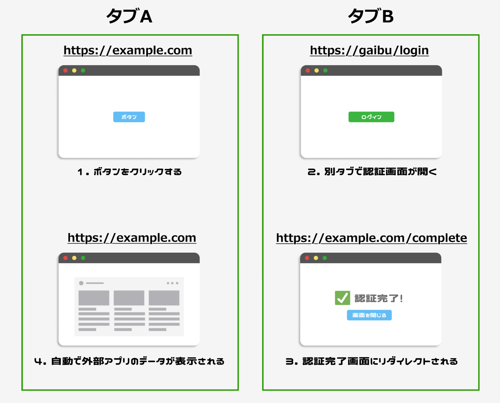

# はじめに

私は普段SaaSアプリケーションのフロントエンドを開発しているのですが、その中で外部アプリと連携する機能を作ることになりました。その機能を作る中で、以下の要件を満たさなければなりませんでした。

1. 自社アプリの画面から外部アプリの認証画面を別タブで開く
2. 認証が完了すると自社アプリと同じオリジンの認証完了画面にリダイレクトする
3. その画面を閉じると自社アプリの画面が自動で更新されており、外部アプリから受け取った情報が一覧表示されている

文字だとわかりにくいので図にすると以下のようになります。



これを実現するために **BroadcastChannel API** が便利だったので紹介します。

## BroadcastChannel APIとは？

[BroadcastChannel API](https://developer.mozilla.org/ja/docs/Web/API/Broadcast_Channel_API) は、同一オリジン内に存在する複数のコンテキスト間（タブ、ウィンドウ、iframeなど）で簡単に通信ができる仕組みです。  
以下のような特徴があります。

- **シンプルな実装**  
  複雑なセットアップが不要で、すぐに利用可能。
- **リアルタイム通信**  
  メッセージの送受信は即時に行われるため、全タブ間で状態を即座に共有できる。
- **軽量な設計**  
  通信インフラを気にせず、シンプルな構成で実現できる。

## 基本的な使い方

以下は、BroadcastChannel API を利用してタブ間通信を実現するコード例です。

```ts
// BroadcastChannelのインスタンスを作成（チャネル名は任意）
const channel = new BroadcastChannel("example_channel");

// メッセージ受信用のリスナーを登録
channel.addEventListener("message", (event) => {
  console.log("受信したメッセージ:", event.data);
  // 必要に応じて、受信したデータに応じた処理を行う
});

// 例として、ボタンがクリックされたときにメッセージを送信する
const sendMessage = () => {
  const message = {
    type: "更新",
    timestamp: new Date().toISOString(),
    data: "新しい情報が更新されました",
  };
  channel.postMessage(message);
  console.log("メッセージ送信:", message);
};

// イベントリスナーの例（ボタンに紐付けなど）
document.getElementById("sendButton").addEventListener("click", sendMessage);
```

上記のコードでは、

- `new BroadcastChannel('example_channel')` によってチャネルを作成。
- `channel.addEventListener('message', ...)` によって、他のタブから送信されたメッセージを待ち受ける。
- `channel.postMessage(message)` を使うことで、自身が持つブラウザコンテキストからメッセージを送信している。

## 実際の利用例（Reactとの連携）

今回はReactで実装してみました。簡単なコード例は以下です。

**親画面（別タブを開いた側のコード）**

```ts
import React, { useEffect } from 'react';

export const Parent => () {
    useEffect(() => {
      const channel = new BroadcastChannel("example-channel");
      const handleMessage = (event: MessageEvent) => {
        if (event.data?.type === "COMPLETED") {
          // ここに処理を記述
        }
      };

      channel.onmessage = handleMessage;
      return () => {
        channel.close();
      };
    });

// 略

}
```

**子画面（別タブで開かれた側のコード）**

```ts
import React, { useEffect } from 'react';

export const Chlid => () {
    useEffect(() => {
      const channel = new BroadcastChannel("example-channel");
      channel.postMessage({ type: "COMPLETED" });
      return () => {
        channel.close();
      };
    }, []);

// 略

}
```

この例では、`example_channel` というチャネル名でタブ間通信を行っています。認証完了画面にリダイレクトされると子画面側の`useEffect`内のコードが実行され、親画面側にイベントが通知されます。そして親画面側の`useEffect`内でイベントが検知され、任意のコードを実行することができます。今回の場合はAPIを叩いて情報を画面に表示するコードを記述することで要件を満たすことができました。
このようにシンプルかつ少ないコード量で実装することができるので、保守性も高く便利です。

## 注意点

ただ使用にあたっては以下の点に注意が必要です。

- **ブラウザのサポート状況**  
  現在、多くのモダンブラウザでサポートされていますが、必ず対象ブラウザの互換性を確認してください。
- **セキュリティとプライバシー**  
  同一オリジンでの使用が前提のため、異なるドメイン間での利用はできません。また、必要に応じてメッセージの内容を暗号化するなど、セキュリティ対策を講じることも考慮が必要です。

## その他の活用事例

今回は別タブのアクションで他のタブの情報を最新化するようなユーザー体験の向上のために実装しましたが、その他の活用事例としては以下が挙げられると思います。

- **認証状態の共有**  
  ユーザーがログアウトしたときに、すべてのタブで同時にログアウト処理を実行するなど。
- **ショッピングカートの同期**  
  複数タブで同じカート情報を共有し、更新があったときに即座に反映させるなど。

## まとめ

BroadcastChannel API を使うことで、シンプルな実装で要件を満たすことができました。  
ユーザー体験の向上やデータ同期が必要なシーンで、このAPIを積極的に活用できると思います。
この記事が少しでもどなたかの役に立ったのなら幸いです。
