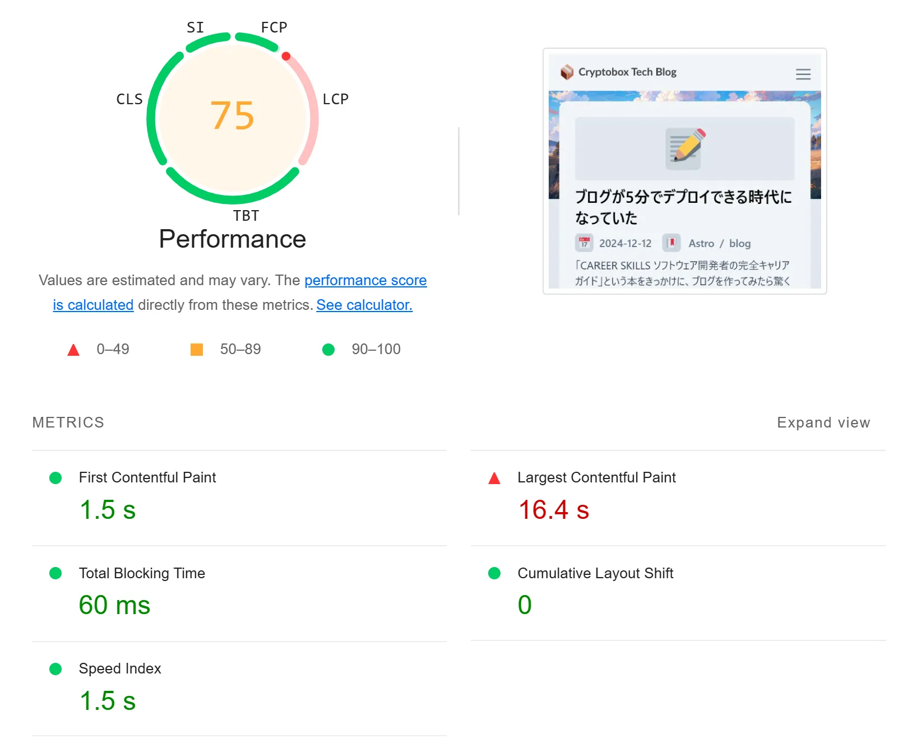
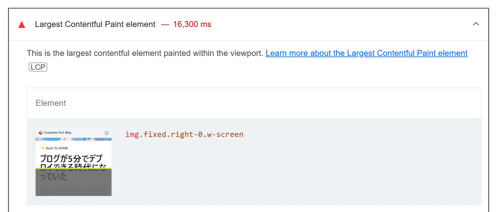
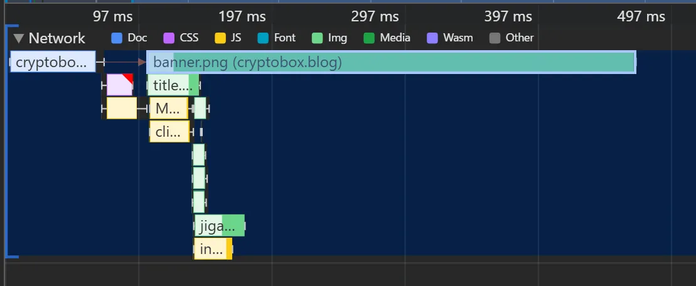
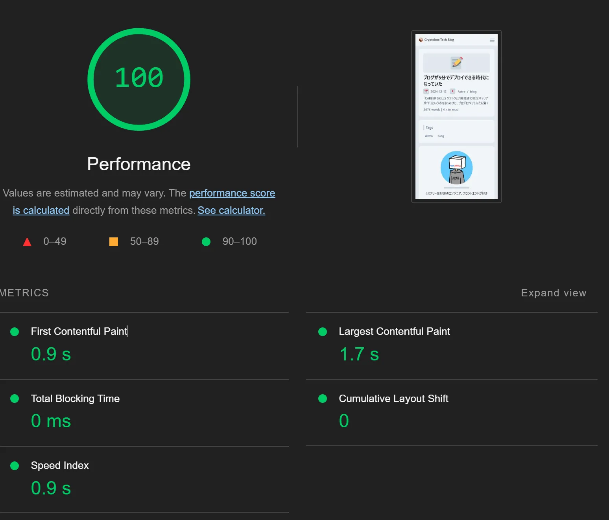
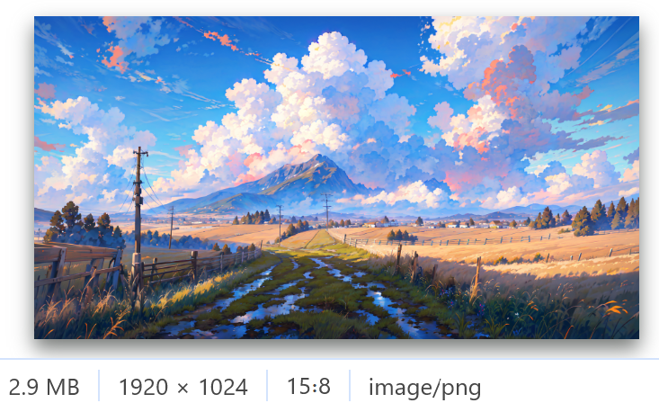
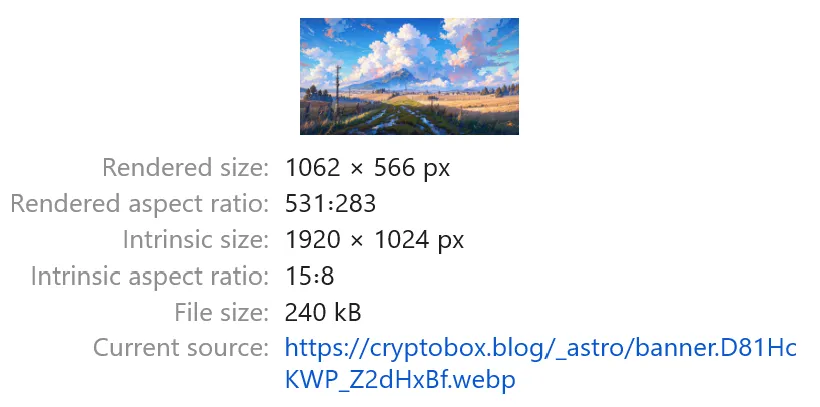
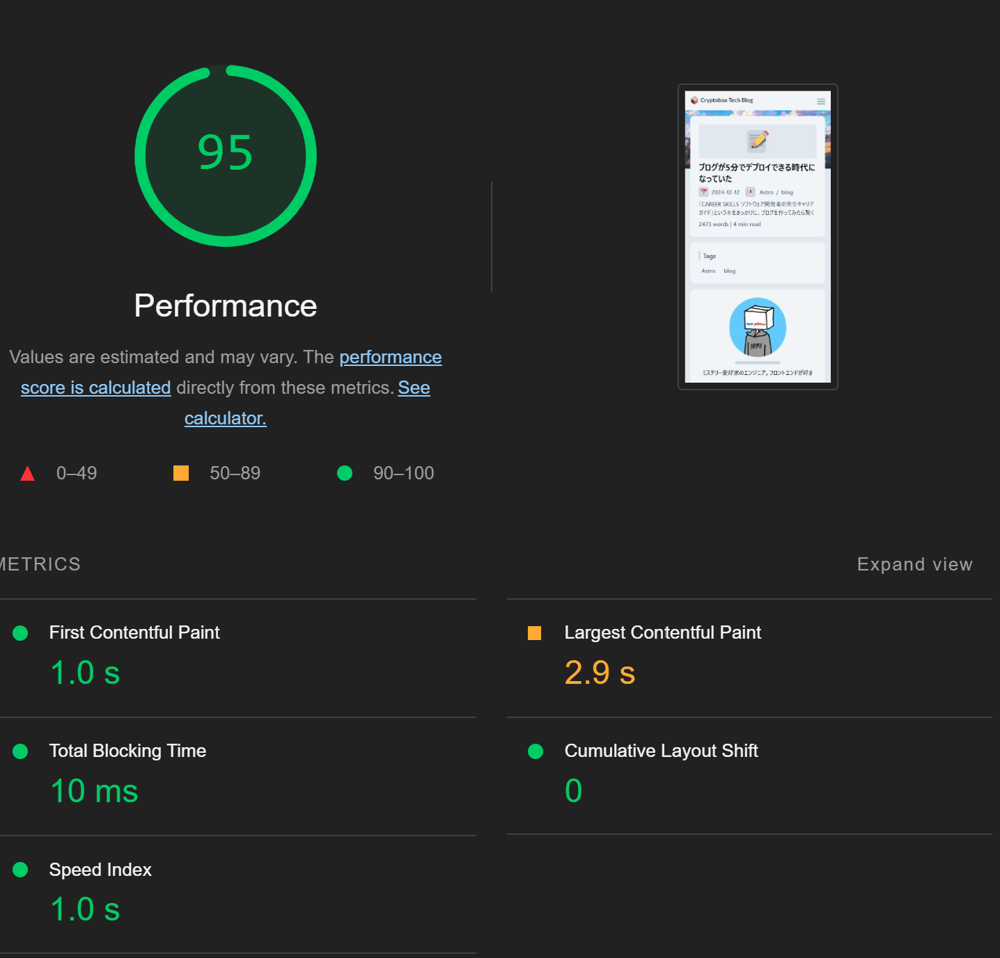
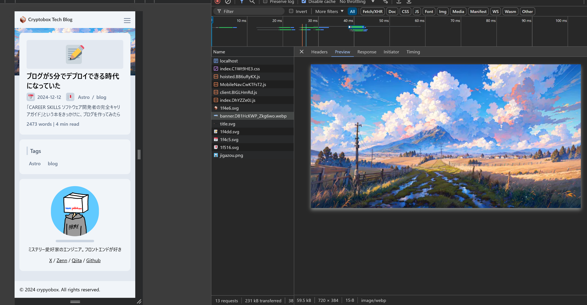
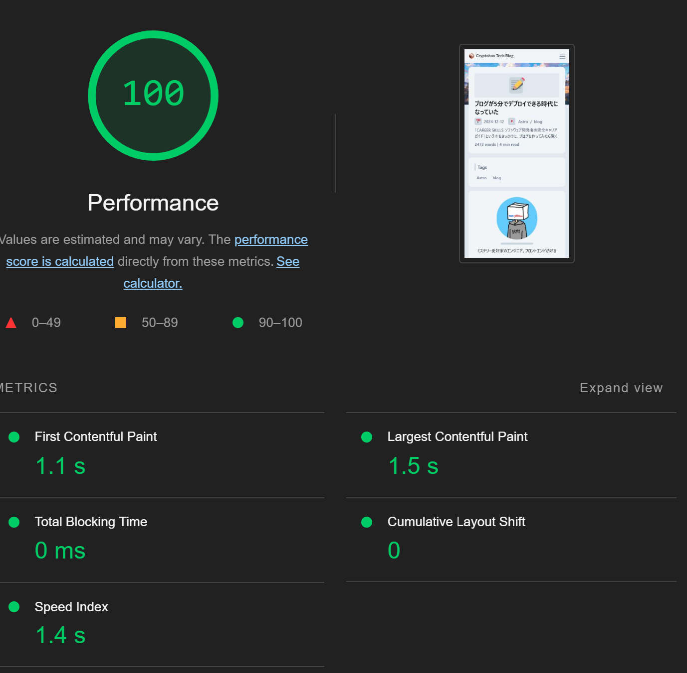
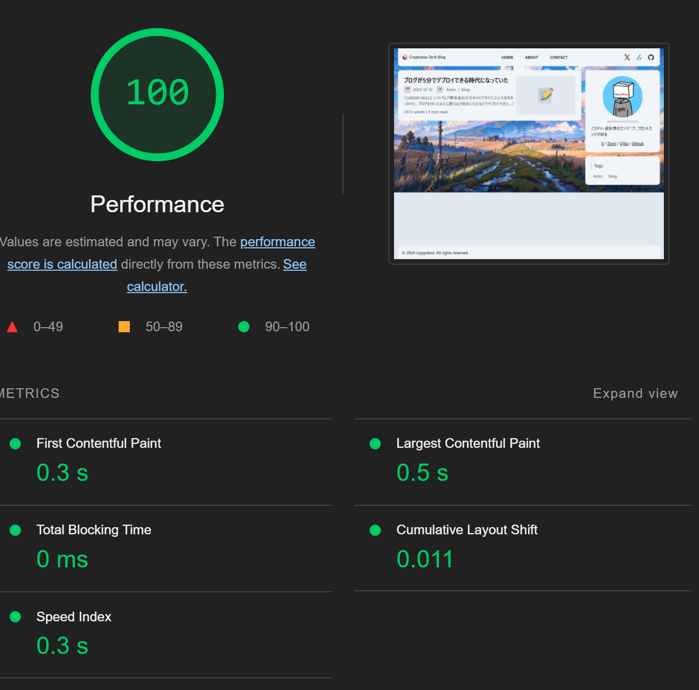

## 😢 ブログの表示が遅い

大体完成した弊ブログだが表示速度が気になる。試しに[Lighthouse](https://developer.chrome.com/docs/lighthouse/overview?hl=ja)でパフォーマンス計測してみたところやっぱり遅い。



LCPのスコアが悪いようだ。詳しく見てみると背景画像がLCPとして認識されており、この画像の表示速度がボトルネックになっていそう。



この画像は`banner.png`として読み込んでいるもので、試しにdevtoolのPerformanceタブで計測しネットワークを監視してみると、確かに読み込みが遅い。



ほぼほぼ原因は特定できたがまだ仮説なので検証してみる。

devtoolのNetworkタブから`banner.png`を右クリックして`Block request URL`を選択し、`banner.png`を読み込まないようにする。この状態でLighthouseでパフォーマンス計測を行い、スコアがどのくらい上がるか検証する。

:::message
これは[mizchiさんによる「LAPRAS 公開パフォーマンスチューニング」調査編](https://www.youtube.com/watch?v=j0MtGpJX81E&ab_channel=LAPRAS%E5%85%AC%E5%BC%8F)で紹介されていた方法。知見の塊なのでかなりオススメな動画。
:::



無事100点が取れた。したがって`banner.png`の表示速度を改善すれば、スコアを確実に上げることができることがわかった。

## 🪛 画像の最適化

Sourceタブから画像のサイズを確認してみると2.9MBとかなり大きい。



googleによると[1つのページでリクエストするリソースの合計サイズは1600kB以下に抑えるべき](https://developer.chrome.com/docs/lighthouse/performance/total-byte-weight?utm_source=lighthouse&utm_medium=unknown&hl=ja#how_to_reduce_payload_size)とのことなので、画像1つだけで超過してしまっていることになる。

このブログはAstroで構築しているのだが、Astroにはすでに画像最適化の仕組みが備わっているらしい。 `src/` に画像を配置し`Astro:asset`から呼び出すだけで自動的にサイズの計算、webpへの変換もしてくれるそう。早速試してみる。

```diff tsx
import bannerImage from "../images/banner.png";
import { Image } from "astro:assets";

- 
+ <Image
+   class="fixed right-0 w-screen"
+   src={bannerImage}
+   alt="banner image"
+ />
```





無事2.9MBから230kBに圧縮され、スコアも95点になった。100点まであと一歩。さらに改善するために画像をレスポンシブ化する。
現状モバイルの画面でも1920x1024サイズの画像を読み込んでしまっているが、`widths`を設定することで画面幅に応じて最適なサイズの画像を読み込むようできる。

```diff tsx
<Image
  class="fixed right-0 w-screen"
  src={bannerImage}
+  widths={[240, 540, 720, bannerImage.width]}
+  sizes={`(max-width: 360px) 240px, (max-width: 720px) 540px, (max-width: 1600px) 720px, ${bannerImage.width}px`}
  alt="banner image"
/>
```




モバイルサイズだと720x384の画像をfetchしておりサイズも59.5kBとさらに削減できていることがわかる。またこの画像は背景画像であり画質にはそこまでこだわらなくて良いはず。`quality`を`low`に指定してでさらに画像を圧縮する。

```diff tsx
<Image
  class="fixed right-0 w-screen"
  src={bannerImage}
  widths={[240, 540, 720, bannerImage.width]}
  sizes={`(max-width: 360px) 240px, (max-width: 720px) 540px, (max-width: 1600px) 720px, ${bannerImage.width}px`}
+ quality={"low"}
  alt="banner image"
/>
```



無事100点を取ることができた。

もちろんデスクトップ環境も100点。(デスクトップ環境ではネットワークスロットルに制限がかからないのでモバイルよりも点数を取るのが簡単)



## 🤓 まとめ

LCPのスコアを改善するためには背景画像の最適化を行った。Astroでは`Astro:asset`から画像を呼び出すだけで自動的にサイズの計算、webpへの変換もしてくれるので、画像の最適化がとても簡単にできる。また`widths`や`quality`の指定をすることでさらに細かくカスタマイズも行えることがわかった。これからも定期的にパフォーマンス計測を行い、改善を続けていきたい。

## 📓 参考

- [クリティカル パスの把握](https://web.dev/learn/performance/understanding-the-critical-path?hl=ja#identifying_the_contentful_rendering_path)
- [画像 | Astro Docs](https://docs.astro.build/ja/guides/images/#mdx%E3%83%95%E3%82%A1%E3%82%A4%E3%83%AB%E5%86%85%E3%81%AE%E7%94%BB%E5%83%8F)
